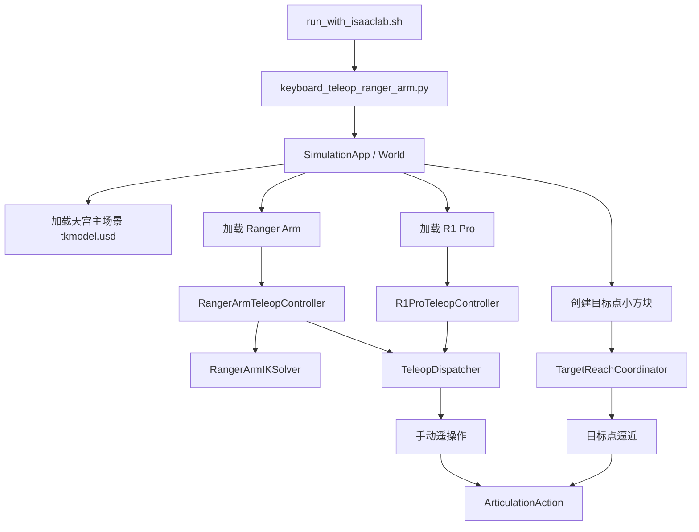
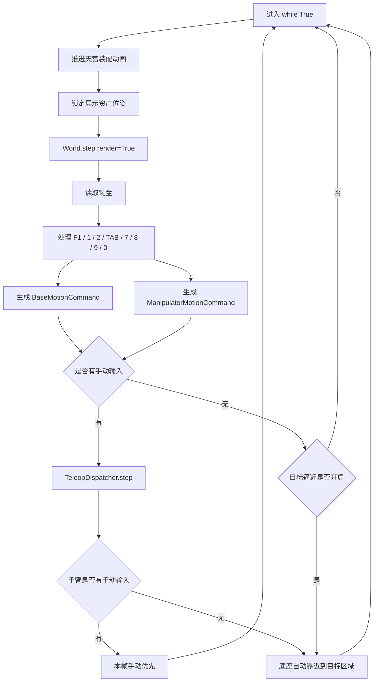
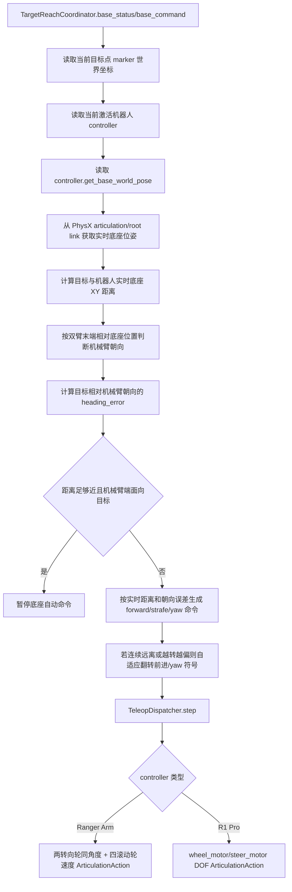
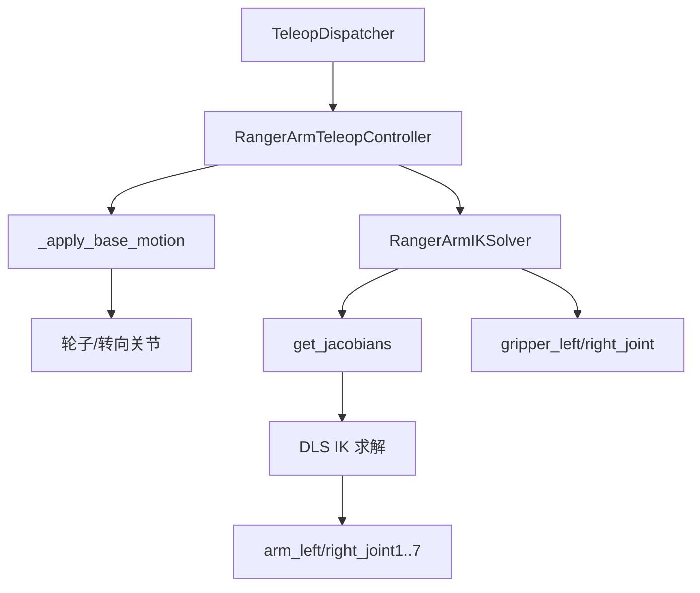
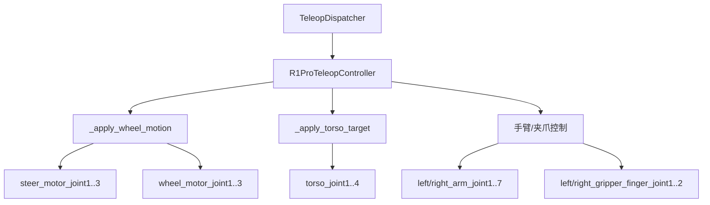

# 天宫场景机器人整体操作流程

本文档描述当前天宫 IsaacSim 场景中的整体操作流程：场景加载、机器人控制器创建、键盘遥操作、目标点创建，以及 Ranger Arm / R1 Pro 底座如何先移动到目标区域。

## 运行入口

```bash
bash scripts/run_with_isaaclab.sh scripts/keyboard_teleop_ranger_arm.py \
  --add-r1pro \
  --r1pro-physics \
  --enable-target-reach \
  --ground-z -10.0 \
  --r1pro-z 0.0
```

`--enable-target-reach` 会在场景中创建三个可拖动、带碰撞的小方块目标点。当前阶段先暂停机械臂自动触及，只启用当前机器人底座向目标区域靠近。

可自定义目标点坐标：

```bash
--target-points "2.75,-2.45,-8.85;3.10,-1.60,-8.75;2.75,-0.75,-8.85"
```

## 总体流程图



主入口仍是 `scripts/keyboard_teleop_ranger_arm.py`。它只负责组织场景、读取键盘和分发命令；机器人具体控制逻辑在 `source/tiangong/tiangong/teleop/` 下。

## 模块职责

| 文件 | 职责 |
| --- | --- |
| `scripts/keyboard_teleop_ranger_arm.py` | 启动 IsaacSim、加载场景、创建控制器、读取键盘、进入主循环。 |
| `teleop/dispatcher.py` | 在 Ranger Arm 和 R1 Pro 控制器之间切换，把统一命令分发给当前激活机器人。 |
| `teleop/ranger_arm_controller.py` | Ranger Arm 底盘和双臂控制入口。 |
| `teleop/ranger_arm_ik.py` | Ranger Arm 差分 IK 求解。 |
| `teleop/r1pro_controller.py` | R1 Pro 底盘、躯干、双臂和夹爪控制。 |
| `teleop/target_reach.py` | 目标点小方块、目标点解析、底座到目标区域的实时距离与靠近命令；末端逼近代码保留但当前暂停调用。 |
| `teleop/drone_controller.py` | 展示资产固定、地面贴合和位姿锁定。 |
| `utils/assets.py` | 项目内 USD 资产路径解析。 |

## 每帧主循环



手动遥操作永远保留。启用目标逼近后：

- 底盘按键仍然可用；没有手动底盘输入时，当前激活机器人会按目标点方向给底座一个小的自动靠近命令，先进入目标区域。默认停止距离约 `1.4m`，并在机械臂所在一端面向目标后停止。
- 手臂按键有输入时，本帧优先手动控制。
- 当前阶段手臂按键没有输入时也不会自动触及目标；机械臂自动目标逼近暂时暂停。
- Ranger Arm 和 R1 Pro 的底座命令都只允许走轮子/转向 DOF；缺少 wheel DOF 时会记录 warning 并跳过底座移动，不用平移 prim 伪造移动。
- 日志实时读取目标方块当前世界坐标，因此鼠标拖动目标后打印的 `target_pos` 是最新位置。

## 按键关系

| 按键 | 功能 |
| --- | --- |
| `F1` | 在可用机器人之间循环切换。 |
| `1` | 切换到 Ranger Arm。 |
| `2` | 切换到 R1 Pro。 |
| `TAB` | 切换当前末端目标：左臂、右臂、双臂。 |
| `7` | 选择第 1 个目标方块。 |
| `8` | 选择第 2 个目标方块。 |
| `9` | 选择第 3 个目标方块。 |
| `0` | 开关目标点自动逼近。 |

目标点模式当前只使用当前激活机器人底座靠近目标区域；`TAB` 选择的手臂暂不自动参与目标触及。

## 目标点逼近流程



目标点数据结构在 `teleop/target_reach.py`：

- `TargetPoint`：目标名、prim 路径、世界坐标、颜色。
- `TargetMarkerManager`：在 `/World/teleop_targets` 下创建带碰撞的小方块；用户可以用鼠标拖动它。
- `EndEffectorTargetReacher`：当前用于读取目标实时坐标、计算底座与目标 XY 距离，并生成“靠近目标且机械臂端面向目标”的底盘命令；末端自动触及逻辑保留但主循环暂不调用。
- `TargetReachCoordinator`：管理当前目标、开关状态和底座自动靠近命令。

## Ranger Arm 控制链



Ranger Arm 当前的目标点逼近只走底盘规划：先让机械臂所在一端朝向目标，再把底座带到 `--target-base-distance` 范围内。机械臂末端自动触碰恢复后会复用 `RangerArmIKSolver.apply_targets()`，因此和键盘 IK 使用同一套 Jacobian 与关节限位逻辑。

Ranger Arm 底盘不是四轮全向，也不是四轮全部独立转向。当前按项目资产的真实约束处理：

- 靠近机械臂的一对轮子负责转向，两个转向关节使用同一个目标角。
- 远离机械臂的一对后轮不参与转向，转向目标保持 `0`。
- 自动 DOF 分类时，名字中包含 `steer` / `steering` 的关节只进入转向列表；即使名字同时包含 `wheel`，也不会再被误归类为滚动轮。
- 若资产中暴露了 4 个 steering DOF，控制器仍只激活两个；启动日志中的 `active_steer_names` 是实际参与转向的关节。
- 四个滚动轮只接收前进/后退滚动速度，不再用后轮转向或横移速度伪造移动。
- Ranger Arm 激活时，手动 `A/D` 表示可转向轮左/右打角；目标点模式下 Ranger Arm 不再尝试原地 yaw，而是用两个同角度转向轮和前后滚动走弧线靠近目标。

## R1 Pro 控制链



R1 Pro 的底盘移动来自官方 USD 中的轮子和转向 DOF，不是平移整个 prim：

```text
steer_motor_joint1..3
wheel_motor_joint1..3
```

目标点模式当前只给当前激活机器人的底盘一个小的自动靠近命令。底盘仍可通过 `W/S/A/D/Q/E` 手动覆盖；机械臂自动触及目标暂时暂停。

## 参数说明

| 参数 | 说明 |
| --- | --- |
| `--enable-target-reach` | 创建目标方块并启用底座自动靠近目标区域。 |
| `--target-points` | 目标坐标列表，格式为 `x,y,z;x,y,z;x,y,z`。 |
| `--ground-z` | 贴地基准高度，默认 `-10.0`；天宫场景地面平面在 `Z=-10` 附近。 |
| `--target-marker-root` | 目标方块根 prim，默认 `/World/teleop_targets`。 |
| `--target-marker-size` | 目标方块尺寸，默认 `0.20` 米；主方块带碰撞，每个目标还会带一根同色竖直提示柱。 |
| `--target-height` | 默认目标点相对 `--ground-z` 的高度，默认 `1.15` 米，接近夹爪水平高度。 |
| `--target-base-distance` | 两台机器人底座辅助靠近的目标 XY 距离，默认 `1.4` 米；该距离是当前阶段的目标区域判定。 |
| `--target-base-command` | 底座自动靠近的最大归一化命令，默认 `0.45`。 |
| `--no-target-base-motion` | 关闭目标模式下的底座自动靠近，仅保留目标方块和实时距离日志。 |
| `--target-reach-speed` | 保留给后续恢复机械臂末端逼近，当前阶段不调用。 |
| `--target-reach-tolerance` | 保留给后续恢复机械臂末端到达判定，当前阶段不调用。 |
| `--target-reach-hold-orientation` | 保留给后续恢复机械臂末端逼近，当前阶段不调用。 |

## 扩展边界

当前目标区域靠近属于天宫场景主流程的一部分，不依赖官方 demo 脚本。当前阶段只提供“底座靠近目标坐标区域”的通用能力：

- Ranger Arm 和 R1 Pro 共用同一套目标点小方块。
- 目标点模式接入当前 `TeleopDispatcher`。
- 原有键盘遥操作路径保留。
- 若未来需要更复杂的轨迹规划、避障或底盘自主导航，可在 `teleop/target_reach.py` 旁新增独立模块，再通过主入口接入模式切换。
